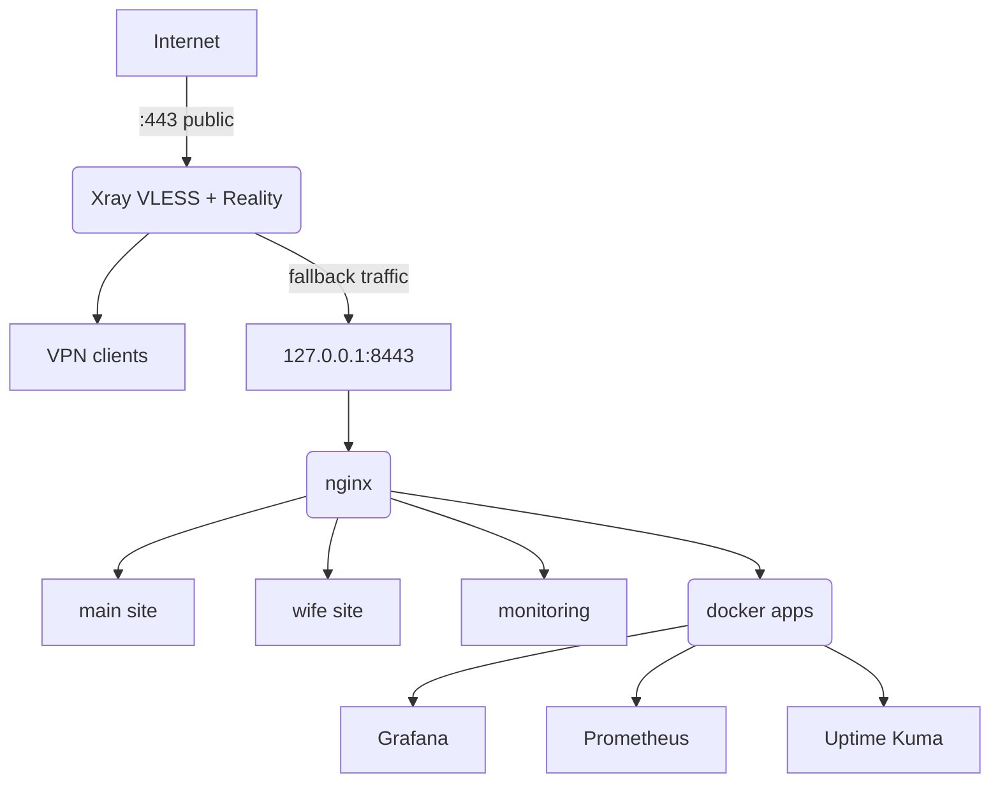

# Infra Self Audit

From a family VPN server to a layered self-hosted stack.

This repository documents the evolution and self-audit of my VPS infrastructure.

The server was originally deployed as a private VPN gateway for family members.
Over time, the infrastructure evolved into a layered self-hosted stack built around:

- Xray Reality ingress
- nginx backend routing
- Docker services
- monitoring stack
- reverse proxy architecture

## Current Understanding

The current infrastructure grew incrementally over time and now contains multiple routing layers.

This repository is also an attempt to better understand:
- fallback behavior
- nginx routing logic
- Docker networking
- reverse proxy chains
- ingress separation
- monitoring integration
