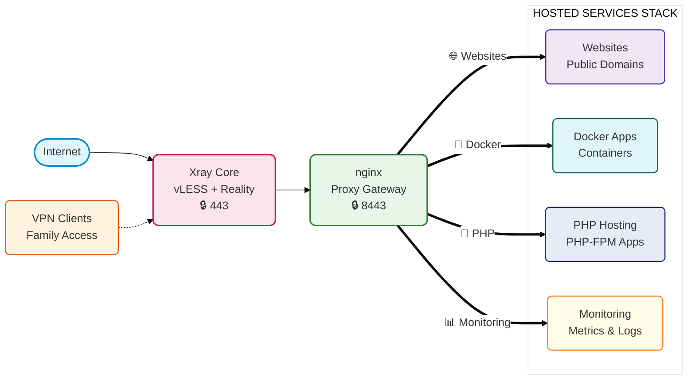

# Infrastructure Self-Audit

A self-hosted infrastructure built as a private VPN gateway and evolved into a layered stack of services, monitoring, and reverse proxy routing.

  <kbd>🌐 Self-Hosted</kbd>
  <kbd>🔒 VPN Gateway</kbd>
  <kbd>🐳 Docker</kbd>
  <kbd>🚀 Nginx</kbd>
  <kbd>⚡ Xray</kbd>
  <kbd>📊 Monitoring</kbd>
  <kbd>🛡️ Reverse Proxy</kbd>

### Overview

The server was originally deployed as a private VPN gateway for family members. Over time, the infrastructure evolved into a layered self-hosted stack built around:

- [x] **Xray Reality ingress** (vLESS over TLS)
- [x] **nginx** reverse proxy and backend routing
- [x] **Dockerized** applications and services
- [x] **Monitoring and observability** stack
- [x] **Hosting for websites** and PHP applications

### Architecture Overview

### Current Understanding

The current infrastructure grew incrementally over time and now contains multiple routing layers. 
This repository documents its architecture, configuration, security posture, and areas for improvement.
