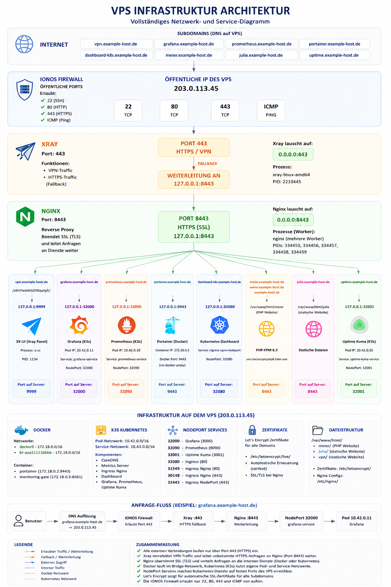
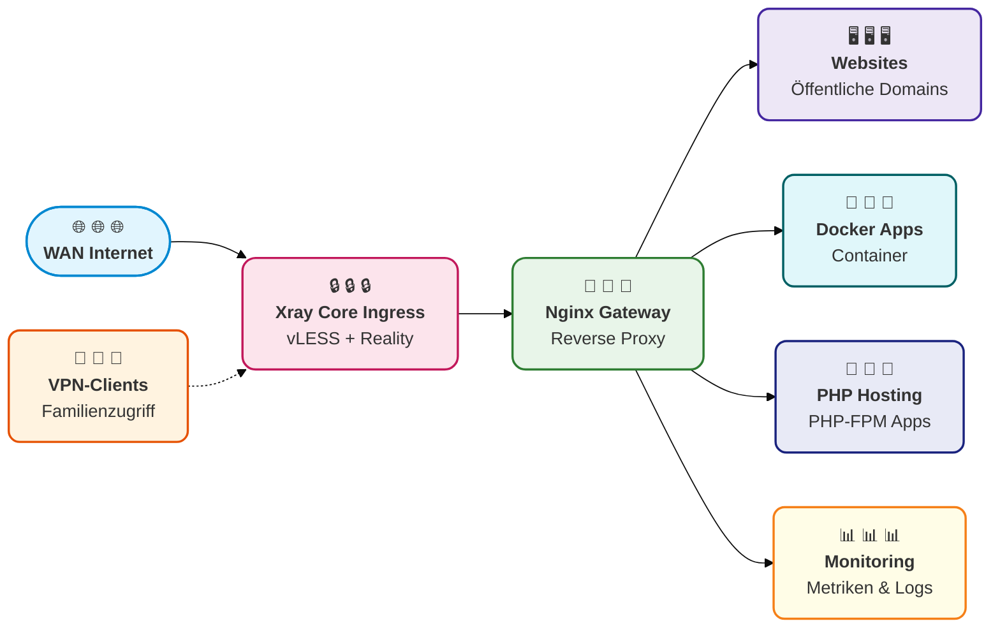

# Infrastructure Self-Audit

# VPS Infrastruktur Architektur

  

  🏆 Linux Essentials (LPI) • Certified 2026

Eine Self-Hosted-Infrastruktur, die ursprünglich als privates VPN-Gateway konzipiert wurde und sich zu einem mehrschichtigen Stack aus Diensten, Monitoring und Reverse-Proxy-Routing weiterentwickelt hat.

  🌐 🔒 🐳 🚀 ⚡ 📊 🛡️

### 📋 Übersicht

Der Server wurde ursprünglich als privates VPN-Gateway für Familienmitglieder bereitgestellt. Im Laufe der Zeit entwickelte sich die Infrastruktur zu einem mehrschichtigen, selbst gehosteten Stack, der auf folgenden Säulen aufbaut:

* ✅ **Xray Reality Ingress** (vLESS über TLS)
* ✅ **Nginx** als Reverse Proxy und Backend-Routing-Instanz
* ✅ **Containerisierte** Anwendungen und Dienste (Docker)
* ✅ **Monitoring und Observability** (Systemüberwachung)
* ✅ **Hosting für Websites** und PHP-Anwendungen
* ✅ **Security Hardening** (Keine offenliegenden Admin-Ports)

### 🗺️ Architektur-Übersicht

### 🛡️ Edge-Routing & Security Hardening

Um automatisierte Scans, Zensur und aktives Probing (Active Probing) zu verhindern, folgt die Infrastruktur einer strikten **Single-Exposed-Port-Policy (nur TCP-Port 443 ist nach außen offen)**. Allen Administrations-Panels und Backend-Diensten wurden die öffentlichen Ports in der Cloud-Firewall (IONOS-Richtlinie) entzogen; sie sind ausschließlich an lokale Schnittstellen (localhost) gebunden.

Konkret wurden alle externen Inbound-Regeln für zentrale Infrastrukturdienste – einschließlich **Portainer (TCP 9000)**, **Uptime Kuma (TCP 3001)**, **3X-UI (TCP 9999/2096)** und benutzerdefinierten Backend-APIs (TCP 8081/9443) – vollständig entfernt und auf Ebene der Edge-Firewall blockiert. Dadurch wird eine Zero-Visibility-Netzwerkstruktur gegenüber öffentlichen Internet-Scannern erreicht.

#### 🔍 Fallstudie: Absicherung des 3X-UI Admin-Panels
Zuvor war das VPN-Verwaltungspanel über einen dedizierten öffentlichen Port (`TCP 9999`) erreichbar, was es anfällig für Fingerprinting machte. Die Architektur wurde angehoben, um vollständige Tarnung (Stealth) zu erreichen:

1. **Firewall Drop**: Port `9999` wurde auf Ebene der externen Cloud-Firewall (IONOS-Richtlinie) komplett gesperbt.
2. **Encrypted Fallback Loop**: Externer Traffic trifft auf `Port 443` (Xray Core Ingress) auf. Normaler Web-Traffic (kein VPN) wird über einen Fallback-Mechanismus an den lokalen `Nginx` auf Port `8443` weitergeleitet.
3. **Nginx Upstream Routing**: Nginx wertet die eingehende Subdomain (`subexample.example.com`) zusammen mit einem kryptografisch sicheren, zufälligen URL-Pfad aus.
4. **Interner SSL-Proxy**: Nginx leitet die Anfrage sicher über lokales HTTPS (`https://127.0.0.1:9999`) weiter. Interne Weiterleitungsschleifen (Redirect Loops) werden vermieden, indem hartcodierte `X-Forwarded-Proto https`-Header übergeben und WebSocket-Upgrades dynamisch verarbeitet werden.

### 📝 Aktueller Stand & Ausblick

Die bestehende Infrastruktur ist im Laufe der Zeit organisch gewachsen und verfügt nun über mehrere Routing-Ebenen. Dieses Repository dokumentiert die Architektur, die Konfiguration, den Sicherheitsstatus sowie potenzielle Bereiche für zukünftige Optimierungen.
