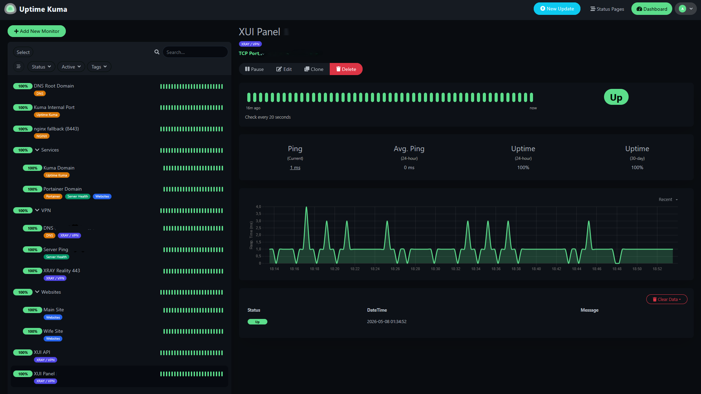

# Infrastructure Audit: Monitoring Layer (Uptime Kuma)

As part of the system self-audit, this document analyzes the current state of the monitoring stack. The monitoring layer is deployed inside an isolated Docker container and continuously tracks edge routing, internal gateways, and web applications.

## Current System Status
The monitoring panel shows a **100% uptime** across all critical components. Latency remains stable with minimal overhead on the internal routing path.

## Audit Findings & Covered Metrics

### 1. Edge & Routing Verification
* **Xray Reality (443):** The public entry point is fully operational and responsive.
* **Nginx Fallback (8443):** The local reverse-proxy traffic handoff works smoothly with zero packet drop.

### 2. Isolated Infrastructure Panels
* **XUI API & Panel:** Management endpoints are restricted to specific local environments and shielded from direct public scanning.
* **Portainer Domain:** Container management is successfully proxied behind a clean domain layer.

### 3. Web & Production Assets
* Both the **Main Site** and **Wife Site** are returning healthy `200 OK` status codes over the internal Nginx loop.

---

## Next Steps
* Implement automated **Telegram alerts** directly from Uptime Kuma for instant downtime notifications.
* Verify if Prometheus scraper targets match the exact active container list found in this dashboard.
